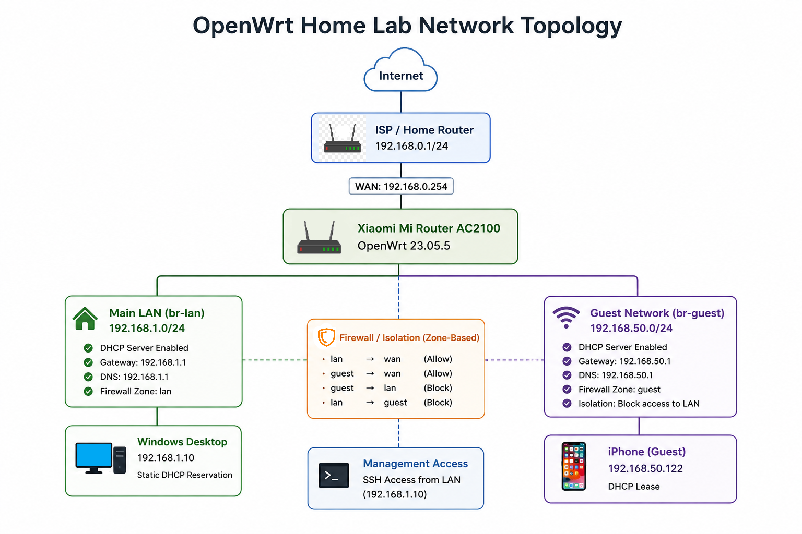

# OpenWrt Home Lab

A hands-on networking project built with OpenWrt to develop practical skills in network administration, Linux command-line management and troubleshooting.

## Overview

This lab uses a Xiaomi Mi Router AC2100 running OpenWrt 23.05.5. I configured and tested a static DHCP reservation, an isolated guest network and SSH-based administration, documenting each stage with notes and screenshots.

## Network Topology



## Key Outcomes

- Reserved `192.168.1.10` for the Windows desktop using DHCP.
- Created a separate guest subnet at `192.168.50.0/24`.
- Allowed guest devices to access the internet while blocking access to the main LAN.
- Connected to the router securely using SSH from Windows PowerShell.
- Inspected system information, interfaces, routes, storage, memory and uptime from the command line.

## Project Walkthrough

| Stage | Work completed | Documentation |
|---|---|---|
| Baseline | Reviewed the original router configuration and recorded the starting state. | [Screenshot](<01 Baseline/screenshots/router-overview.png>) |
| Static DHCP Reservation | Assigned the desktop a predictable IP address and verified connectivity and DNS. | [Notes](<02 Static DHCP Reservation/notes/notes.md>) · [Screenshots](<02 Static DHCP Reservation/screenshots>) |
| Guest Network | Created a separate bridge, subnet, SSID, DHCP service and firewall zone. | [Notes](<03 Guest Network/notes/notes.md>) · [Screenshots](<03 Guest Network/screenshots>) |
| SSH Administration | Managed the OpenWrt router remotely and inspected its Linux-based system. | [Notes](<04 SSH Administration/notes/notes.md>) · [Screenshots](<04 SSH Administration/screenshots>) |

## Hardware and Software

- Xiaomi Mi Router AC2100
- Windows 10 desktop
- iPhone used for guest-network testing
- OpenWrt 23.05.5
- LuCI web interface
- Windows PowerShell
- OpenSSH Client

## Skills Demonstrated

- DHCP configuration and reservations
- IPv4 addressing and subnets
- Network segmentation
- Firewall zones and access control
- Wireless network configuration
- SSH remote administration
- Linux command-line inspection
- Routing and connectivity testing
- Technical documentation

## Repository Structure

```text
OpenWrt-Home-Lab/
├── 00 Project Overview/
├── 01 Baseline/
├── 02 Static DHCP Reservation/
├── 03 Guest Network/
├── 04 SSH Administration/
├── images/
└── README.md
```

## Security Note

OpenWrt configuration backup archives are stored locally and intentionally excluded from this public repository because they may contain credentials, password hashes, keys or device-specific configuration.

## Future Improvements

- Smart Queue Management (SQM)
- VLAN configuration
- WireGuard VPN
- AdGuard Home
- Network monitoring and remote logging
